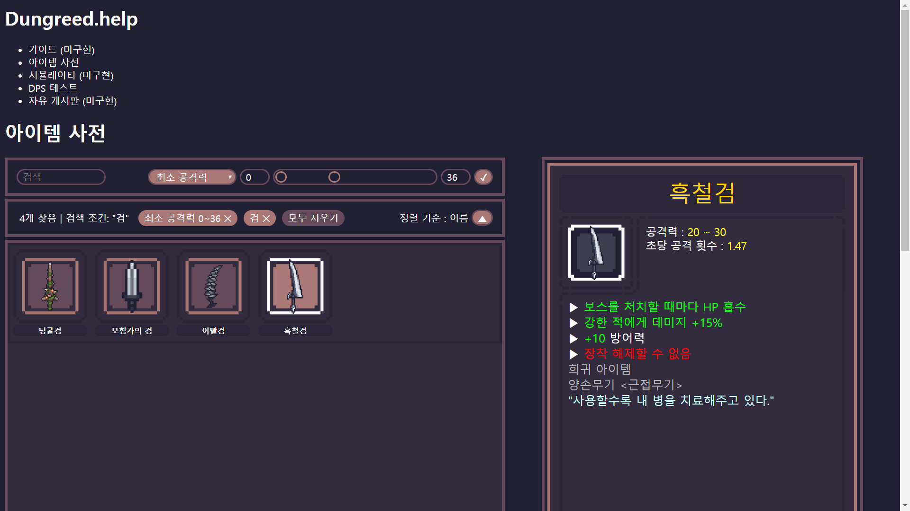

# Django_project

## 소개
- 기간 : 2019.06.27 ~ 현재
- 개발 환경 : VS Code, Django, Python,  jQuery, SQLite3

dungreed라는 게임의 플레이를 도우려고 제작한 웹사이트입니다.
현재 간단한 DPS 계산기와 아이템 도감을 완성하였고, 검색기능을 추가로 구현했고, 필터를 개발중입니다.

메인페이지의 게임 소개, 게임 가이드, 아이템 시뮬레이터와 로그인 기능을 추가하여 자유게시판을 만들고 배포할 계획입니다.
아직 배포하지 못한 관계로 이미지를 첨부하겠습니다. 아래는 아이템 도감 이미지입니다.
